 

 

## Introduction
This repository contains a list of CVEs that have been found and documented by the Hacking-Notes team. Each entry includes details about the vulnerability, its impact, and potential mitigation strategies.

## List of CVEs

Blog Articles: https://hacking-notes.medium.com/

Patched
- <a href="https://medium.com/@hacking-notes/cve-2024-51490-ampache-v7-0-0-xss-admin-account-compromise-1331e282c83c">CVE-2024-51490</a> ---> Stored Cross-Site Scripting | Admin Account Takeover | Custom URL - Logo
- <a href="https://github.com/ampache/ampache/security/advisories/GHSA-4xw5-f7xm-vpw5">CVE-2024-51486</a> ---> Stored Cross-Site Scripting | Admin Account Takeover | Custom URL - Favicon
- <a href="https://github.com/ampache/ampache/security/advisories/GHSA-4q69-983r-mwwr">CVE-2024-51489</a> ---> CSRF - Insufficient Validation | Sending Messages Without Proper Validation
- <a href="https://github.com/ampache/ampache/security/advisories/GHSA-46m4-5pxj-66f2">CVE-2024-51488</a> ---> CSRF - Insufficient Validation | Delete Message Without Proper Validation
- <a href="https://github.com/ampache/ampache/security/advisories/GHSA-xvfj-w962-hqcx">CVE-2024-51485</a> ---> CSRF - Insufficient Validation | Plugins (Activation/Deactivation) Without Proper Validation
- <a href="https://github.com/ampache/ampache/security/advisories/GHSA-h6vj-6rvc-3x29">CVE-2024-51484</a> ---> CSRF - Insufficient Validation | Controllers (Activation/Deactivation) Without Proper Validation
- <a href="https://github.com/ampache/ampache/security/advisories/GHSA-5rmx-fjmc-mg6x">CVE-2024-51487</a> ---> CSRF - Insufficient Validation | Catalog (Activation/Deactivation) Without Proper Validation
- <a href="https://hacking-notes.medium.com/cve-2024-51379-jatos-v3-9-3-stored-xss-description-component-de49d0077a96">CVE-2024-51379</a> ---> Stored Cross-Site Scripting | Admin Account Takeover
- <a href="https://hacking-notes.medium.com/cve-2024-51380-jatos-v3-9-3-stored-xss-properties-component-44aea338ee9c">CVE-2024-51380</a> ---> Stored Cross-Site Scripting | Admin Account Takeover
- <a href="https://medium.com/@hacking-notes/cve-2024-51381-jatos-v3-9-3-csrf-admin-account-creation-94035f24d0be">CVE-2024-51381</a> ---> CSRF - Missing protection | Admin Account Creation
- <a href="https://medium.com/@hacking-notes/cve-2024-51382-jatos-v3-9-3-csrf-admin-password-reset-1adeff0386ed">CVE-2024-51382</a> ---> CSRF - Missing protection | Admin Password Reset

## 🧰 Hacking Notes Ecosystem

🌐 &nbsp;**[hacking-notes.com](https://hacking-notes.com)** &nbsp;·&nbsp; ✍️ &nbsp;**[blog](https://hacking-notes.medium.com/)** &nbsp;·&nbsp; 💬 &nbsp;**[discord](https://discord.gg/r68ameNHrD)**

| | Resource | What you get |
| :-: | -------- | ------------ |
| 🗺 | **[Hacker-Roadmap](https://github.com/Hacking-Notes/Hacker-Roadmap)** | Structured paths from beginner to pro — hobbyist, bug bounty, certs & degree. |
| 🔴 | **[RedTeam Notes](https://github.com/Hacking-Notes/RedTeam)** | Offensive security notes: recon, exploitation, Windows & Linux. |
| 🔷 | **[BlueTeam Notes](https://github.com/Hacking-Notes/BlueTeam)** | Defensive security notes: forensics, malware, log & packet analysis. |
| 🧩 | **[Extensions](https://github.com/Hacking-Notes/Extensions)** | Curated Chrome extensions for ethical hacking & recon. |
| 🔖 | **[Bookmarks](https://github.com/Hacking-Notes/Bookmarks)** | Curated hacker bookmark collection, one import away. |

<a href="#top">⬆ back to top</a>

